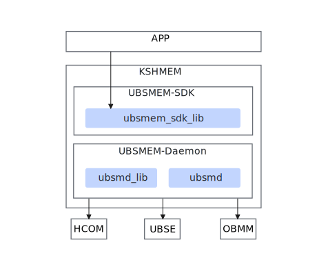
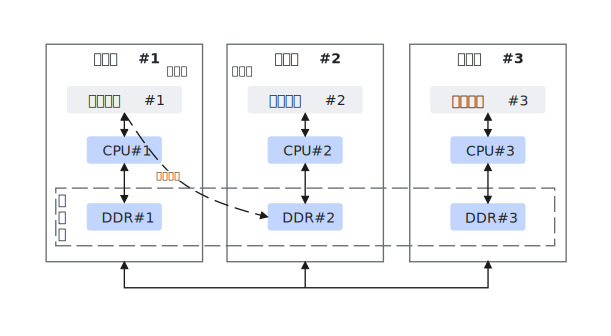
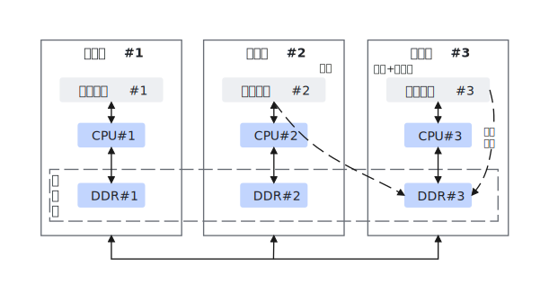

# 产品描述

## 产品介绍

UBS Memory是在超节点上基于底层UB Memory能力提供的高阶服务能力，实现UB（Unified Bus，灵衢总线）系统上的内存借用和内存共享，为上层应用提供UB Memory的简易使用能力。通过对底层硬件能力和OS层接口的封装和集成，提供类posix逻辑的操作接口，同时受限于芯片和UB协议的约束限制，明确接口和编程模型的约束和时序规则。

UBS Memory特性分为内存借用和内存共享两类，纵向层次分为应用层、UBSMEM-SDK层、UBSMEM-Daemon层以及底层外部依赖（包括HCOM、UBSE、OBMM、DLock等）。

**图 1**  系统设计方案  

-   APP：应用层。
-   KSHMEM
    -   UBSMEM-SDK：SDK端，对上层应用提供内存借用、内存共享访问相关系列接口。

        ubsmem\_sdk\_lib：应用集成内存借用、内存共享的动态库，提供相关API接口支持。

    -   UBSMEM-Daemon：守护进程，负责节点内内存借用、内存共享相关元数据缓存。
        -   ubsmd\_lib：南向对接UBSE、北向对接SDK，提供节点内内存借用、内存共享相关元数据缓存。
        -   ubsmd：可执行文件，加入系统systemd服务，提供内存管理服务。

-   底层外部依赖
    -   HCOM：高性能通信组件，负责跨节点数据交换、跨节点数据一致性和应用透明。
    -   UBSE：管控面，负责软件定义计算、资源按需组合与分配。
    -   OBMM：提供内存导出、导入等基本功能。
    -   DLock：一种用于管理分布式系统中锁机制的工具，主要用于协调多个节点之间的资源访问，确保同一时间只有一个节点可以访问特定资源。

## 内存借用

本机（使用方）借用其他服务器（提供方）的内存。使用方和提供方属于不同的服务器。

**图 2**  内存借用  

## 内存共享

创建方创建共享内存，写方写数据到共享内存，读方从共享内存读取数据。创建方、写方、读方可以由一个应用程序承担，也可以单独存在。

**图 3**  内存共享  

