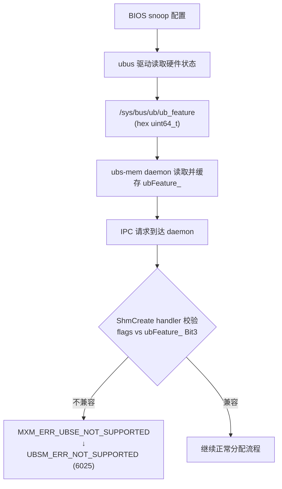
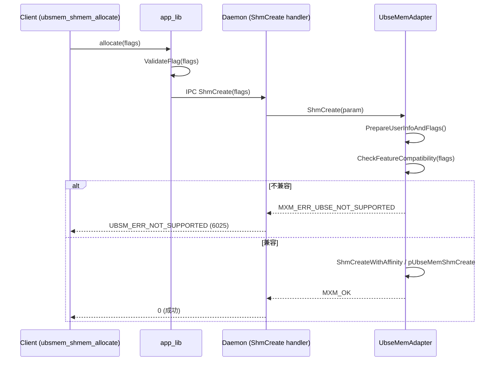

# 技术设计方案：基于 ubfeature 的 Cache 模式校验

> 相关 Issue: [#39](https://gitcode.com/openeuler/ubs-mem/issues/39)

## 1. 概述（Overview）

### 1.1 背景摘要

UBS Mem 共享内存支持多种缓存模式，其中与 snoop 强相关的有两种：

- **CC 模式（全 Cacheable，`UBSM_FLAG_CACHE` / `UBSM_FLAG_WITH_LOCK`）**：导出方和导入方均使用 Cacheable 模式访问共享内存，通过 `ubsmem_shmem_set_ownership` 接口进行读写权限切换保障一致性。要求 BIOS **关闭** snoop。
- **NC-CC（半 NonCache）**：导出方使用 Cacheable，导入方使用 NonCache（`UBSM_FLAG_ONLY_IMPORT_NONCACHE`），通过 `O_SYNC` 保证数据一致性。要求 BIOS **开启** snoop。

当前代码通过 `ValidateFlag()` 仅校验 flag 组合合法性，未感知硬件/BIOS 层面的 snoop 状态。当用户在不匹配的 snoop 环境下使用错误的缓存模式时，可能导致数据错误（NC-CC 在 snoop 关闭时）或死锁（CC 模式在 snoop 打开时）。

### 1.2 目标

在 `ubsmem_shmem_allocate` / `ubsmem_shmem_allocate_with_provider` 接口中，基于 ubus 驱动通过 `/sys/bus/ub/ub_feature` 暴露的 `ubfeature` 能力位（Bit3，由 BIOS snoop 配置决定），校验用户传入的 flags 是否与当前硬件 snoop 状态兼容，不兼容时返回 `UBSM_ERR_NOT_SUPPORTED`。

### 1.3 非目标

- 不修改 BIOS snoop 配置行为
- 不修改 UBSE 引擎的内存分配逻辑
- 不影响 `ubsmem_shmem_set_ownership` 等已有接口

---

## 2. 用例分析（Use Case Analysis）

### 2.1 功能场景

| 场景 | snoop 状态 | ubfeature Bit3 | CC 模式 (UBSM_FLAG_CACHE / UBSM_FLAG_WITH_LOCK) | NC-CC (UBSM_FLAG_ONLY_IMPORT_NONCACHE) |
|------|-----------|-----------------|-------------------------------------------------|----------------------------------------|
| A | 关闭（OFF） | 1 | 允许 | **拒绝**（返回 NOT_SUPPORTED） |
| B | 开启（ON） | 0 | **拒绝**（返回 NOT_SUPPORTED） | 允许 |

### 2.2 验收标准

1. snoop 打开时，使用 `UBSM_FLAG_CACHE` 或 `UBSM_FLAG_WITH_LOCK`（CC 模式）调用 `ubsmem_shmem_allocate` 返回 `UBSM_ERR_NOT_SUPPORTED`（6025）
2. snoop 关闭时，使用 `UBSM_FLAG_ONLY_IMPORT_NONCACHE` 调用 `ubsmem_shmem_allocate` 返回 `UBSM_ERR_NOT_SUPPORTED`（6025）
3. snoop 打开时，使用 `UBSM_FLAG_ONLY_IMPORT_NONCACHE` 调用正常成功
4. snoop 关闭时，使用 `UBSM_FLAG_CACHE` 或 `UBSM_FLAG_WITH_LOCK`（CC 模式）调用正常成功
5. 对 `ubsmem_shmem_allocate_with_provider` 同样生效

### 2.3 性能指标

- feature 位读取及校验引入的开销应可忽略（<1us），不影响 allocate 主路径性能

### 2.4 DFX 要求

- **兼容性**：`/sys/bus/ub/ub_feature` 不存在（旧设备无此文件）→ 跳过校验，兼容旧设备
- **可观测性**：校验失败时输出包含原因和 flag 值的日志
- **可测试性**：校验逻辑应与硬件读取解耦，可通过设置缓存状态进行单元测试

---

## 3. 方案设计（Design）

### 3.1 总体设计

#### 3.1.1 架构总览



#### 3.1.2 核心逻辑流程



> `ShmCreateWithProvider` 路径同理，在 `PrepareShmCreateWithProviderParams()` → `PrepareUserInfoAndFlags()` 之后插入相同的校验。

#### 3.1.3 约束与限制

- `/sys/bus/ub/ub_feature` 由 ubus 内核驱动提供，仅在宿主机上可见，容器内不可访问
- 校验逻辑在 daemon 侧执行，通过 `SystemAdapter` 读取宿主机 sysfs 文件
- Bit3 语义由 BIOS/ubus 驱动约定，ubs-mem 不自行解释其他 bit

### 3.2 备选方案

**问题**：校验应放在 client 侧还是 daemon 侧？

| 方案 | 描述 | 优点 | 缺点 |
|------|------|------|------|
| Client 侧校验 | 在 `ubsmem_shmem_allocate_impl` 中提前校验 | 不兼容请求无需 IPC，更高效 | client 可能运行在容器内，无法访问 `/sys/bus/ub/ub_feature`；需新增 IPC 消息或客户端文件读取，改动较大 |
| **Daemon 侧校验** | daemon 读取 sysfs，在 `UbseMemAdapter::ShmCreate` 中校验 | daemon 天然可访问 sysfs；复用现有 NOT_SUPPORTED 错误链路；改动最小 | 不兼容请求仍需一次 IPC 往返 |

**采用 Daemon 侧校验**，理由：

1. **容器隔离**：Client 可能运行在容器内部，而 `/sys/bus/ub/ub_feature` 是宿主机上的 sysfs 文件，容器内不可见
2. **一致性**：与代码库中已有的 NOT_SUPPORTED 错误处理模式一致（参见 `ubse_mem_adapter.cpp:481,516,1076,1189`），都是在 daemon 侧校验后返回 `MXM_ERR_UBSE_NOT_SUPPORTED`
3. **影响可控**：IPC 校验失败不是热路径——触发频率极低（仅为环境配置错误），一次 UDS 往返开销可忽略

### 3.3 功能实现设计

#### 3.3.1 读取 ubfeature

在以下位置分别新增：

**读取逻辑** — `src/under_api/sys/system_adapter.h/.cpp`：

```cpp
// SystemAdapter 新增静态方法（用于可测试性，可 mock）
static bool ReadUbfeatureFromSysfs(uint64_t &value);
```

实现：读取 `/sys/bus/ub/ub_feature` 文件第一行的 hex 字符串，解析结果通过 `value` 输出，返回值表示读取和解析是否成功。

**存储与触发** — `src/under_api/ubse/ubse_mem_adapter.h/.cpp`：

- 静态成员 `ubFeature_`（uint64_t）
- 静态成员 `ubFeatureLoaded_`（bool，确保只读一次，防重复 open）
- 静态成员 `ubFeatureValid_`（bool，标记文件是否成功读取，决定是否开启校验）
- 在 `UbseMemAdapter::Initialize()` 中调用 `SystemAdapter::ReadUbfeatureFromSysfs()` 并缓存结果

**容错处理**：
- 文件不存在 → `ubFeatureValid_` = `false`，`ubFeatureLoaded_` = `true`，后续 `ShmCreate` 中跳过校验，兼容旧设备
- 解析失败 → 同文件不存在

#### 3.3.2 校验逻辑

**调用位置**：
- `UbseMemAdapter::ShmCreate()` — 在 `PrepareUserInfoAndFlags()` 之后，`ShmCreateWithAffinity()` 之前
- `UbseMemAdapter::ShmCreateWithProvider()` — 在 `PrepareShmCreateWithProviderParams()` 之后，`pUbseMemShmCreateWithLender()` 之前

**校验函数**：

```cpp
#define UBS_FEATURE_BIT_CC_CACHEABLE (1ULL << 3)

int UbseMemAdapter::CheckFeatureCompatibility(uint64_t flags)
{
    // ubfeature 文件不存在（旧设备），跳过校验，保持兼容
    if (!ubFeatureValid_) {
        return MXM_OK;
    }

    // Bit3 = 1: snoop 关闭, CC 模式支持, NC-CC 不支持
    // Bit3 = 0: snoop 开启, NC-CC 支持, CC 模式不支持

    if (flags & UBSM_FLAG_ONLY_IMPORT_NONCACHE) {
        // NC-CC 模式: 要求 snoop 打开 (Bit3 = 0)
        if (ubFeature_ & UBS_FEATURE_BIT_CC_CACHEABLE) {
            DBG_LOGERROR("NC-CC mode (UBSM_FLAG_ONLY_IMPORT_NONCACHE) not supported "
                         "when snoop is off (ubfeature Bit3=1)");
            return MXM_ERR_UBSE_NOT_SUPPORTED;
        }
    } else if (!(flags & UBSM_FLAG_NONCACHE)) {
        // CC 模式 (CACHE / WITH_LOCK, 即既不设 NONCACHE 也不设 ONLY_IMPORT_NONCACHE): 要求 snoop 关闭 (Bit3 = 1)
        if (!(ubFeature_ & UBS_FEATURE_BIT_CC_CACHEABLE)) {
            DBG_LOGERROR("CC mode (UBSM_FLAG_CACHE / UBSM_FLAG_WITH_LOCK) not supported "
                         "when snoop is on (ubfeature Bit3=0)");
            return MXM_ERR_UBSE_NOT_SUPPORTED;
        }
    }

    return MXM_OK;
}
```

#### 3.3.3 错误码映射

复用已有映射：`MXM_ERR_UBSE_NOT_SUPPORTED` → `UBSM_ERR_NOT_SUPPORTED` (6025)。

#### 3.3.4 对 `allocate_with_provider` 的处理

`ubsmem_shmem_allocate_with_provider` 后端路径为 `UbseMemAdapter::ShmCreateWithProvider()`，其与 `ShmCreate()` 是独立的两条代码路径，不相互调用。`ShmCreateWithProvider()` 通过 `PrepareShmCreateWithProviderParams()` 内部调用 `PrepareUserInfoAndFlags()` 解析 flag，之后同样需要插入 `CheckFeatureCompatibility()` 校验。

### 3.4 安全与 DFX 设计

- **安全性**：校验为防御性编程，不引入新的安全风险
- **隐私**：不涉及用户数据
- **兼容性**：`/sys/bus/ub/ub_feature` 不存在（旧设备无此文件）→ 跳过校验，兼容旧设备
- **可观测性**：校验失败时输出 `DBG_LOGERROR`，含 flags 值和 ubfeature 位信息
- **可测试性**：`CheckFeatureCompatibility()` 逻辑独立，通过设置缓存的 feature 状态进行单元测试
- **可维护性**：集中在校验函数中，后续扩展更多 feature bit 只需修改掩码和逻辑

### 3.5 编程接口设计

#### 3.5.1 对外接口

无新增或变更的公共 API。用户通过 `ubsmem_shmem_allocate()` 传入不兼容的 flags 时，接口返回 `UBSM_ERR_NOT_SUPPORTED`（6025）。

#### 3.5.2 新增内部函数

| 函数 | 位置 | 用途 |
|------|------|------|
| `SystemAdapter::ReadUbfeatureFromSysfs(value)` | `src/under_api/sys/system_adapter.cpp` | 从 sysfs 读取 ubfeature 值，通过返回值表示是否成功 |
| `UbseMemAdapter::CheckFeatureCompatibility(flags)` | `src/under_api/ubse/ubse_mem_adapter.cpp` | 校验 flags 与缓存的 ubfeature 是否兼容 |

---

## 4. 风险与缺点（Risks & Drawbacks）

| 风险 | 影响 | 缓解措施 |
|------|------|----------|
| `/sys/bus/ub/ub_feature` 在不同内核版本语义不一致 | 校验逻辑可能误判 | 文件不存在时跳过校验（兼容旧设备）；后续可通过配置覆盖 |
| sysfs 读取在高并发下可能有短暂阻塞 | allocate 首调用延迟增加 | 仅初始化时读取一次并缓存，后续零开销 |
| client 在容器内无法访问 `/sys/bus/ub/ub_feature` | 无法在 client 侧提前校验 | 仅 daemon 侧校验，client 不依赖此文件；不兼容请求的 IPC 往返非热路径，影响可忽略 |

---

## 5. 现有技术（Prior Art）

代码库中已有同类模式：

- **UBSE NOT_SUPPORTED 处理**：`src/under_api/ubse/ubse_mem_adapter.cpp` 中已有 ~19 处 `UBS_ERR_NOT_SUPPORTED → MXM_ERR_UBSE_NOT_SUPPORTED` 映射（如 Line 481, 516, 1076, 1189）
- **Flag 校验前置**：`src/app_lib/mxm_shm_lib/mxmem_shmem.cpp:296` 的 `ValidateFlag()` 在 IPC 之前拦截非法组合
- **配置读取**：`src/process/common/util/conf_constants.h:30` 已有 daemon 侧配置读取模式
- **测试模式**：`test/mxm-unit-tests/ubse_sdk/ubse_sdk.cpp` 的 mock 通过 name 中包含 `_NOT_SUPPORTED` 触发出错

---

## 6. 未解决问题（Open Issues）

不涉及。
