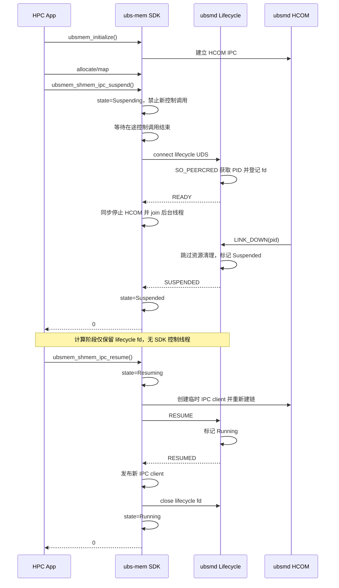
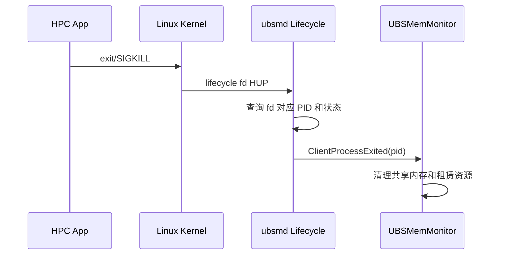
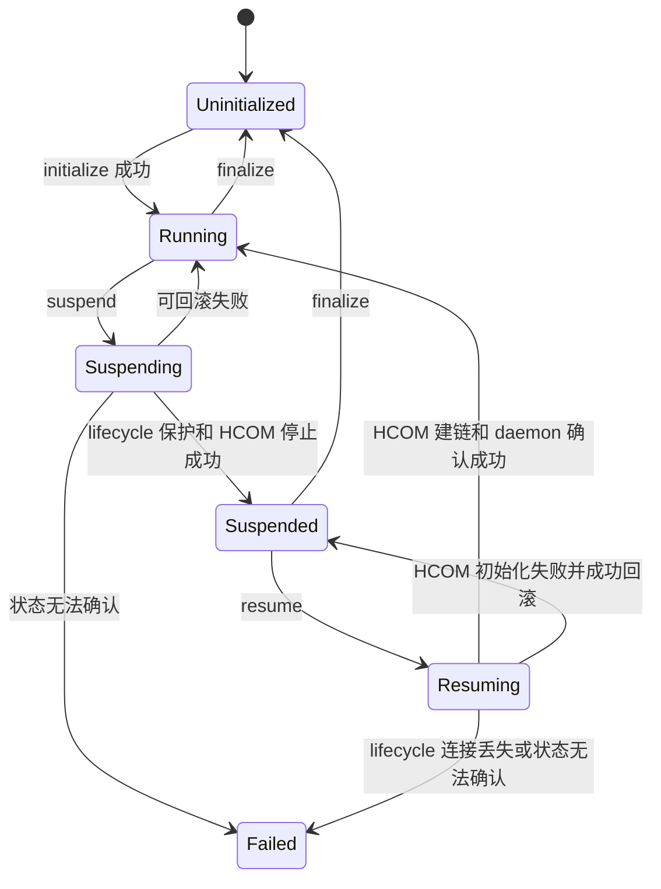

# ubs-mem IPC Suspend/Resume 功能设计

**作者：** openEuler sig-UB-ServiceCore

**创建日期：** 2026-07-28

**更新日期：** 2026-07-28

**相关 Issue：** [openeuler/ubs-mem#42](https://gitcode.com/openeuler/ubs-mem/issues/42)

## 1. 概述

### 1.1 简介

ubs-mem SDK 初始化 HCOM IPC client 后，会创建约 7 个后台线程。其中 ubs-mem
代码明确配置了 6 个 HCOM worker，第 7 个为 HCOM 内部管理线程。这些线程负责
SDK 与 `ubsmd` 之间的资源控制，不参与共享内存 map 后的普通数据读写，但
busy-polling 模式会占用 CPU，影响 HPC 计算阶段的时延稳定性。

本设计新增以下接口：

```c
int ubsmem_shmem_ipc_suspend(void);
int ubsmem_shmem_ipc_resume(void);
```

应用完成共享内存分配和映射后，可以调用 suspend 停止 HCOM、关闭控制连接并
退出相关后台线程。已映射内存仍可直接读写。计算结束后调用 resume，重新初始化
HCOM 并恢复控制接口。

### 1.2 动机

当前 SDK 的控制通路如下：

```text
应用控制 API
    -> IpcProxy
    -> MxmIpcClient
    -> HCOM UDS
    -> ubsmd
```

共享内存 map 完成后的数据通路如下：

```text
应用 load/store
    -> 本进程 mmap 地址
    -> OBMM/UB 数据通路
```

数据读写不逐次经过 HCOM，因此计算阶段可以停止控制通路而保留数据通路。

直接销毁 HCOM 会触发 daemon 的 `LINK_DOWN` 处理。当前 daemon 将断链视为
客户端退出，并调用 `ClientProcessExited(pid)` 清理共享内存和租赁记录。因此必须
让 daemon 区分应用主动 suspend 和应用真正退出。

### 1.3 目标

- suspend 成功后退出 SDK HCOM 创建的 7 个后台线程。
- suspend 期间已完成 map 的内存继续可读写。
- suspend 期间资源控制 API 快速返回确定错误，不进入 IPC 超时。
- resume 成功后恢复 HCOM、UDS 连接和控制接口。
- suspend/resume 支持幂等调用。
- suspend/resume 与普通控制 API、finalize 之间并发安全。
- suspend 期间应用异常退出时，daemon 能及时清理资源。
- 不持久化仅用于临时生命周期管理的 PID 状态。
- 新 SDK 对不支持该功能的旧 daemon 快速返回
  `UBSM_ERR_NOT_SUPPORTED`。

非目标：

- 不暂停应用线程或共享内存数据通路。
- 不自动管理用户基于映射地址创建的工作线程。
- 不保证初始化后 fork 的子进程可继续使用 SDK。
- 不改变现有共享内存、租赁内存和分布式锁协议。
- 不把 suspend 作为进程迁移、checkpoint 或数据一致性屏障。

## 2. 用例分析

### 2.1 正常计算流程

```text
initialize
-> allocate/create
-> map
-> suspend
-> 仅访问已映射内存
-> resume
-> unmap/deallocate
-> finalize
```

预期行为如下：

| 阶段 | 数据读写 | 控制接口 | HCOM 线程 |
| --- | --- | --- | --- |
| Running | 可用 | 可用 | 存在 |
| Suspending/Resuming | 不受 SDK 限制 | 返回 `UBSM_ERR_BUSY` | 迁移中 |
| Suspended | 可用 | 返回 `UBSM_ERR_BUSY` | 不存在 |
| 恢复 Running | 可用 | 可用 | 恢复 |

### 2.2 异常退出

应用在 Suspended 状态被 `SIGKILL` 或异常退出时，内核自动关闭 lifecycle fd。
daemon 收到 `EPOLLHUP` 或 `EPOLLRDHUP` 后，根据 fd 对应的内核凭据获取 PID，
并执行现有 `ClientProcessExited(pid)` 清理流程。

该方案不使用持久 PID 数组，可以避免 stale PID、PID 重用和固定容量耗尽。

### 2.3 重复调用

| 调用 | 当前状态 | 结果 |
| --- | --- | --- |
| suspend | Running | 执行 suspend |
| suspend | Suspended | 幂等返回成功 |
| resume | Suspended | 执行 resume |
| resume | Running | 幂等返回成功 |
| suspend/resume | 状态迁移中 | 返回 `UBSM_ERR_BUSY` |
| suspend/resume | 未初始化 | 返回 `UBSM_ERR_MEMLIB` |
| 普通控制 API | Suspended | 返回 `UBSM_ERR_BUSY` |

### 2.4 性能要求

- suspend 成功后，进程线程数相对默认初始化状态减少 7。
- Suspended 状态下不保留 SDK busy-polling 线程。
- lifecycle client 仅保留一个 UDS fd，不创建客户端线程。
- 已映射内存的带宽和访问时延不因 lifecycle fd 而发生可测回退。
- 建议验收标准为 Suspended 状态 60 秒内，SDK 控制面消耗不超过单核 CPU
  的 0.1%，最终阈值由社区性能测试确认。
- suspend/resume 超时时间应独立于当前 60 秒 IPC timeout，建议默认为 5 秒。

### 2.5 使用约束

- 调用 suspend 前，所有共享内存必须完成 map。
- suspend 期间不得调用 map、unmap、allocate、deallocate、lookup、lock、
  unlock、attach、detach 等控制接口。
- suspend 时不得持有需要通过 IPC 释放的分布式锁。
- 应用对映射地址的访问必须符合原有 ownership 和锁语义。
- 初始化后 fork 暂不支持，子进程不得调用 suspend/resume 或其他 SDK
  控制接口。

## 3. 方案设计

### 3.1 总体方案

新增独立的 lifecycle UDS：

```text
/run/matrix/memory/ubsm_lifecycle
```

该连接只在 suspend 窗口存在，用于：

- 证明客户端进程仍然存活。
- 确认 daemon 已建立 suspend 保护。
- 确认 daemon 已观察到原 HCOM 断链。
- 显式区分正常 resume 与应用异常退出。

lifecycle socket 不传输共享内存业务数据，客户端不创建接收线程，通过同步
`poll`、`send` 和 `recv` 完成状态切换。

#### 3.1.1 正常时序



#### 3.1.2 Suspended 状态异常退出



### 3.2 客户端状态机



状态定义如下：

```cpp
enum class IpcLifecycleState {
    UNINITIALIZED,
    RUNNING,
    SUSPENDING,
    SUSPENDED,
    RESUMING,
    FINALIZING,
    FAILED,
};
```

使用同一把 lifecycle mutex 保护：

- 生命周期状态。
- 当前 IPC client。
- lifecycle fd。
- 在途控制请求计数。
- suspend/resume/finalize 的互斥关系。

普通控制 API 在入口获取 control lease。suspend 首先将状态改为
`SUSPENDING`，禁止新请求，然后等待在途请求归零。

不能仅在 `IpcProxy::SyncCall()` 中检查状态，因为 unmap、unlock 等接口可能在
发 IPC 前已经修改本地映射或 ownership。状态检查必须位于公共控制 API 的
副作用之前。

### 3.3 Lifecycle 协议

建议使用固定长度、显式版本的内部协议：

```cpp
struct LifecycleMessage {
    uint32_t magic;
    uint16_t version;
    uint16_t command;
    int32_t status;
    uint32_t reserved;
};
```

命令定义如下：

| 命令 | 方向 | 说明 |
| --- | --- | --- |
| `READY` | daemon -> SDK | daemon 已通过 `SO_PEERCRED` 登记客户端 |
| `SUSPENDED` | daemon -> SDK | daemon 已观察 HCOM LINK_DOWN 并进入保护状态 |
| `RESUME` | SDK -> daemon | 新 HCOM 已建链，请求退出保护状态 |
| `RESUMED` | daemon -> SDK | daemon 已恢复 Running |
| `CANCEL` | SDK -> daemon | suspend 失败，撤销保护 |
| `FINALIZE` | SDK -> daemon | Suspended 状态下结束 SDK 生命周期 |

协议要求：

- opcode 使用显式固定值，不能依赖枚举插入顺序。
- 所有字段固定宽度。
- 检查 magic、version、长度和 command。
- send/recv 必须处理短读写、`EINTR` 和超时。
- 不支持协议版本时返回 `UBSM_ERR_NOT_SUPPORTED`。
- lifecycle fd 设置 `CLOEXEC`。
- daemon 使用 `SO_PEERCRED`，不接受客户端自报 PID。

### 3.4 Suspend 流程

1. 获取生命周期独占锁。
2. `RUNNING` 以外按幂等或错误规则处理。
3. 状态改为 `SUSPENDING`，禁止新控制请求。
4. 等待已有控制请求完成。
5. 连接 lifecycle UDS。
6. 等待 daemon 返回 `READY`。
7. 同步停止 HCOM client。
8. 停止并 join reconnect 任务和 HCOM worker。
9. 等待 daemon 返回 `SUSPENDED`。
10. 状态改为 `SUSPENDED`。
11. 返回成功。

失败处理如下：

| 失败点 | 回滚 |
| --- | --- |
| lifecycle connect/READY 失败 | 关闭 lifecycle fd，恢复 Running |
| HCOM stop 失败但连接仍可用 | 发送 CANCEL，恢复 Running |
| HCOM 已停止但 SUSPENDED 超时 | 尝试重建 HCOM 并发送 CANCEL |
| daemon 状态无法确认 | 进入 Failed，禁止继续使用控制接口 |

API 返回成功必须表示 daemon 已确认 suspend 保护、HCOM 连接已经断开，且 HCOM
worker 和 reconnect 线程已经退出。

### 3.5 Resume 流程

1. 获取生命周期独占锁。
2. 状态改为 `RESUMING`。
3. 创建临时 IPC client。
4. 启动 HCOM worker 并建立 UDS 连接。
5. 注册 reconnect/resource-check 回调。
6. 通过 lifecycle fd 发送 `RESUME`。
7. daemon 原子切换到 Running 并返回 `RESUMED`。
8. 将临时 IPC client 发布为正式 client。
9. 关闭 lifecycle fd。
10. 状态改为 `RUNNING`。
11. 返回成功。

失败处理如下：

- HCOM 初始化或建链失败时销毁临时 client，保持 lifecycle fd，回到
  `SUSPENDED`。
- RESUME 超时且 lifecycle fd 有效时销毁临时 client，回到 `SUSPENDED`。
- lifecycle fd 断开时进入 `FAILED`，因为 daemon 可能已经执行资源清理。
- 不允许初始化成功后直接把半成品 client 留在全局变量中。

### 3.6 Daemon 状态管理

daemon 使用内存态 session，不写入 `RecordStore`：

```cpp
enum class LifecycleSessionState {
    PREPARED,
    SUSPENDED,
    RESUMING,
    RESUMED,
};

struct LifecycleSession {
    int fd;
    pid_t pid;
    uid_t uid;
    gid_t gid;
    LifecycleSessionState state;
};
```

维护以下受同一 mutex 保护的索引：

```text
fd  -> LifecycleSession
pid -> fd
```

处理规则如下：

| 事件 | 处理 |
| --- | --- |
| accept | 获取 `SO_PEERCRED`，登记 PREPARED，返回 READY |
| HCOM LINK_DOWN 且 PID 有 PREPARED session | 标记 SUSPENDED，跳过清理，返回 SUSPENDED |
| lifecycle HUP 且状态为 PREPARED/SUSPENDED/RESUMING | 删除 session 并执行 `ClientProcessExited` |
| 收到 RESUME 且新 HCOM 已连接 | 标记 RESUMED，返回 RESUMED |
| lifecycle HUP 且状态为 RESUMED | 仅删除 session，不清理 |
| daemon 退出 | 关闭 listener 和所有 session fd |

与 `feat/ipc-suspend-resume` 不同，本设计不在 `/ubsm_records` 中增加
`SuspendClientArray`。

### 3.7 HCOM 生命周期修正

当前 `MxmComStopIpcClient()` 返回 `void`，`IpcProxy::Destroy()` 固定返回成功，
不能支持强验收语义。需要调整为可报告错误的同步接口。

同时需要修复 reconnect 生命周期：

- 禁止 detached `std::thread([this])`。
- reconnect 线程由 engine 持有并可 join。
- Stop 首先设置 stopping 状态。
- stopping 后禁止创建新的 reconnect 任务。
- 唤醒并 join reconnect 线程。
- join 完成后销毁 channel、memory region 和 HCOM service。
- HCOM `Destroy()` 错误向上传递。
- client 指针与引用计数由同一把锁保护。

### 3.8 技术选型比较

| 方案 | 优点 | 缺点 | 结论 |
| --- | --- | --- | --- |
| 持久 PID 数组 | 改动较小；IPC ACK 可避免登记竞态 | 崩溃后 stale PID；PID 重用；容量耗尽；无存活凭证 | 不采用 |
| 原 lifecycle fd 原型 | 内核自动检测死亡；无持久脏状态 | 无 READY ACK；accept 竞态；无法区分 resume close 和进程死亡 | 改进后采用 |
| 本设计 lifecycle 协议 | 有存活凭证、明确 ACK、可事务回滚 | daemon 增加 event-driven listener 和协议状态机 | 推荐 |
| 使用 finalize/initialize | 可复用现有 API | finalize 语义过重，可能影响 OBMM、metadata 和其他模块 | 不采用 |
| 将 HCOM worker 改为 sleep | 不需要断链 | 线程仍存在，无法保证 HPC 无调度抖动 | 不采用 |

### 3.9 影响范围

| 模块 | 改动 |
| --- | --- |
| `src/app_lib/include/ubs_mem.h` | 新增两个公共 C API |
| SDK lifecycle 管理 | 新增状态机、control lease、lifecycle client |
| `IpcProxy` | 支持临时 client、同步 stop 和错误上传 |
| IPC client interface | 统一保护全局 client，不再依赖裸指针和独立 atomic |
| HCOM engine | reconnect 可停止、可 join |
| communication constants | 新增 lifecycle socket path 和协议常量 |
| daemon monitor | lifecycle listener、session 表、LINK_DOWN 联动 |
| daemon 初始化/销毁 | 启停 lifecycle listener |
| API 文档 | 增加调用顺序、状态和错误码说明 |
| 单元及集成测试 | 增加 lifecycle、并发、异常和性能测试 |

不修改：

- `RecordStore` 持久化布局。
- 共享内存数据结构。
- OBMM 映射格式。
- 现有共享内存 IPC 消息。

### 3.10 接口设计

#### 3.10.1 ubsmem_shmem_ipc_suspend

```c
SHMEM_API int ubsmem_shmem_ipc_suspend(void);
```

停止 SDK 控制面 HCOM client。已映射共享内存保持有效，普通 load/store 不受
影响。

前置条件：

- SDK 已初始化。
- 当前状态为 Running 或 Suspended。
- 不持有需要 IPC 释放的锁。
- 调用方不再发起新的控制操作。

| 返回值 | 说明 |
| --- | --- |
| `UBSM_OK` | 已进入 Suspended，或原本已 Suspended |
| `UBSM_ERR_BUSY` | 有状态迁移或控制操作未能在超时前结束 |
| `UBSM_ERR_NOT_SUPPORTED` | daemon 不支持 lifecycle 协议 |
| `UBSM_ERR_NET` | lifecycle UDS 通信失败 |
| `UBSM_ERR_MEMLIB` | SDK 未初始化或 HCOM 停止失败 |
| `UBSM_ERR_BUFF` | lifecycle 协议格式错误或内部状态不可恢复 |

#### 3.10.2 ubsmem_shmem_ipc_resume

```c
SHMEM_API int ubsmem_shmem_ipc_resume(void);
```

重新创建 HCOM client、建立 daemon 连接并恢复控制接口。

| 返回值 | 说明 |
| --- | --- |
| `UBSM_OK` | 已恢复 Running，或原本已 Running |
| `UBSM_ERR_BUSY` | 当前正在进行其他生命周期迁移 |
| `UBSM_ERR_NOT_SUPPORTED` | daemon 不支持 lifecycle 协议 |
| `UBSM_ERR_NET` | HCOM 或 lifecycle UDS 通信失败 |
| `UBSM_ERR_MEMLIB` | HCOM 初始化失败 |
| `UBSM_ERR_BUFF` | daemon 与 SDK 状态无法确认 |

#### 3.10.3 调用示例

```c
ubsmem_options_t options;
ubsmem_init_attributes(&options);

int ret = ubsmem_initialize(&options);
if (ret != UBSM_OK) {
    return ret;
}

/* allocate/create/map */

ret = ubsmem_shmem_ipc_suspend();
if (ret != UBSM_OK) {
    ubsmem_finalize();
    return ret;
}

/* Only access previously mapped memory here. */
run_hpc_computation();

ret = ubsmem_shmem_ipc_resume();
if (ret != UBSM_OK) {
    ubsmem_finalize();
    return ret;
}

/* unmap/deallocate */
return ubsmem_finalize();
```

不需要在 `ubsmem_options_t` 中增加 enable 字段。显式调用 suspend API 本身已经
代表用户启用该能力，可以避免改变 options ABI。

## 4. 安全隐私与 DFX 设计

### 4.1 安全

- lifecycle socket 位于现有受控运行目录。
- daemon 使用 `SO_PEERCRED` 获取 PID、UID 和 GID。
- 不接受客户端传入其他 PID。
- 每个 PID 同时最多一个 lifecycle session。
- socket 设置 `CLOEXEC`，避免 exec 后错误继承。
- daemon 对连接数设置上限，并限制到与 ubs-mem 相同的本地用户权限。
- 非法协议、版本和重复命令立即关闭连接并记录审计日志。
- 不将生命周期状态写入共享持久化区域。

### 4.2 可靠性

- suspend/resume 使用状态机和事务化回滚。
- 所有 daemon session 索引由同一 mutex 保护。
- lifecycle HUP 是进程死亡的内核凭证。
- API 成功返回前等待 daemon 状态确认。
- daemon 重启导致 lifecycle fd 断开时，SDK 进入 Failed，不允许静默继续使用
  映射控制接口。
- finalize 在 Suspended 状态通过 `FINALIZE` 或关闭 lifecycle fd 触发 daemon
  清理，不能遗留 suspend session。

### 4.3 兼容性

- 新增公共符号，不修改既有函数签名。
- 不修改 `ubsmem_options_t`。
- 老 SDK 与新 daemon 按原流程工作。
- 新 SDK 连接老 daemon 时 lifecycle socket 不存在，快速返回
  `UBSM_ERR_NOT_SUPPORTED`。
- 功能实现必须重放到当前 master，不能直接以两个实验分支的共同旧基线合入。

### 4.4 可观测性

建议在生命周期转换日志中记录：

```text
pid, lifecycle state, transition, elapsed_us, hcom_thread_count
```

需要记录 lifecycle accepted/closed、suspend READY、HCOM stop、SUSPENDED、
resume HCOM start、RESUMED、状态回滚、进入 Failed 以及 Suspended 客户端异常
退出后的清理结果。

日志不得在 HPC Suspended 稳态周期性输出。

## 5. 测试与验收

### 5.1 单元测试

- 生命周期状态转换。
- 重复 suspend、重复 resume。
- 未初始化调用。
- lifecycle connect、READY、SUSPENDED、RESUME 各阶段失败。
- HCOM stop/start 失败和回滚。
- control lease 与 suspend 并发。
- suspend/resume 与 finalize 并发。
- reconnect 线程停止和 join。
- lifecycle 协议短读写、非法版本、非法 command。
- daemon session 表并发增删。
- HUP 在不同状态下的清理行为。

建议测试位置：

```text
test/mxm-unit-tests/app_testcase/
test/mxm-unit-tests/communication/ipc/
test/mxm-unit-tests/monitor/
```

### 5.2 集成测试

1. initialize 后确认默认增加 7 个 HCOM 线程。
2. allocate/map 后写入已知数据。
3. 调用 suspend。
4. 确认 7 个 HCOM 线程全部退出。
5. 持续读写映射并校验数据。
6. 调用 lookup、unmap 等控制接口，确认快速返回 `UBSM_ERR_BUSY`。
7. 调用 resume。
8. 确认 HCOM 线程和 UDS 连接恢复。
9. 确认控制接口恢复成功。
10. 重复 suspend/resume 1000 次，线程数、fd 数和 RSS 不增长。

### 5.3 异常测试

- Suspended 状态 `SIGKILL`，daemon 正确清理。
- SUSPENDING 各阶段退出。
- RESUMING 各阶段退出。
- daemon 在 Suspended 状态重启。
- lifecycle fd 被意外关闭。
- HCOM 断链和 suspend 同时发生。
- 多客户端并行 suspend/resume。
- PID 快速重用。
- finalize while suspended。
- fork 后调用 API，稳定返回不支持或明确错误，不能死锁和崩溃。

### 5.4 性能验收

- 使用 `/proc/<pid>/task` 和线程名确认线程变化。
- 使用 `perf stat` 统计 Suspended 状态下 `task-clock`、context switch 和 CPU
  migration。
- 对比 suspend 前后的 HPC kernel P50、P99 和最大时延。
- 对比 suspend 前后映射内存带宽，确认数据面无显著回退。
- 记录 suspend/resume P50、P99 延迟。

## 6. 缺点和风险

| 风险 | 影响 | 应对 |
| --- | --- | --- |
| lifecycle daemon listener 增加实现复杂度 | daemon 多一个状态机和 event-driven 线程 | 协议保持最小化，集中到独立模块 |
| HCOM Destroy 不保证同步退出 | suspend 成功后仍可能有线程 | 修改返回链并 join reconnect/HCOM worker |
| 所有控制 API 都需要状态 gate | 改动面较大 | 统一 control lease，逐项审计副作用入口 |
| daemon 重启导致 lifecycle fd 断开 | Suspended 应用资源状态不确定 | SDK 进入 Failed 并禁止继续控制操作 |
| 应用误在 suspend 期间调用 unmap/lock | 可能产生本地副作用 | 在公共 API 入口提前拒绝 |
| 外部 HCOM 第 7 个线程来源尚未在本仓确认 | 线程验收可能与版本相关 | 联查对应 ubs-comm 版本并增加线程基线测试 |

## 7. 现有实现分析

### 7.1 feat/ipc-suspend-resume

可借鉴内容：

- daemon ACK 后才停止 HCOM 的顺序。
- 新增公共 C API 的位置和基本命名。
- 正常 resume 时重新初始化 HCOM 并建链。

不采用内容：

- `SuspendClientArray` 持久 PID 表。
- 无状态机的全局 client/refcount 操作。
- resume 部分成功后不回滚。

### 7.2 feat/suspend-resume-lifecycle

可借鉴内容：

- lifecycle fd 作为存活凭证。
- `SO_PEERCRED` 获取 PID。
- suspend 稳态客户端不创建线程。

必须修正内容：

- listener 未实际启动。
- connect 没有 daemon READY ACK。
- 正常 resume close 与进程死亡 HUP 无法区分。
- resume 在新 HCOM 建链前关闭 lifecycle fd。
- 全局 lifecycle 状态无锁。
- finalize 未关闭 lifecycle fd。

## 8. 未解决问题

RFC 通过前需要社区确认：

1. “全部后台线程”是否仅指默认 HCOM 创建的 7 个线程，还是还包括可选
   ptracer、UBSE 和异步 logger 线程。
2. 对应 ubs-comm 版本中第 7 个线程的确切名称、创建位置及 Destroy 同步退出
   保证。
3. Suspended 状态下持有分布式读写锁是否直接禁止。
4. daemon 重启期间是否要求已 suspend 应用继续存活并恢复。本设计默认进入
   Failed。
5. suspend/resume 的默认超时时间和性能验收阈值。
6. `FAILED` 状态是否允许通过完整 finalize/initialize 恢复，还是要求进程退出。
7. 是否新增专用 `UBSM_ERR_INVALID_STATE`，还是复用现有 `UBSM_ERR_BUSY`。
8. finalize while suspended 的正式语义，是显式发送 `FINALIZE`，还是将
   lifecycle HUP 统一作为退出处理。

## 9. 参考资料

- [Issue #42：ubs-mem 支持关闭额外的 7 个线程](https://gitcode.com/openeuler/ubs-mem/issues/42)
- `main/master`：`84dcff6704b9902b77e39d80edd71be928d8cd86`
- `feat/ipc-suspend-resume`：`054304dcd0153e675051e7bda8cc43f2298265d0`
- `feat/suspend-resume-lifecycle`：`877333c7dca05abc82c33e529ce7430323c875db`
