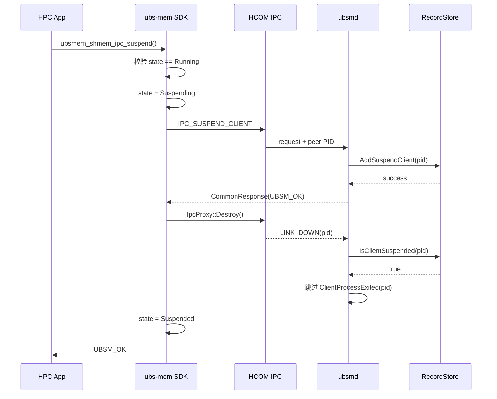
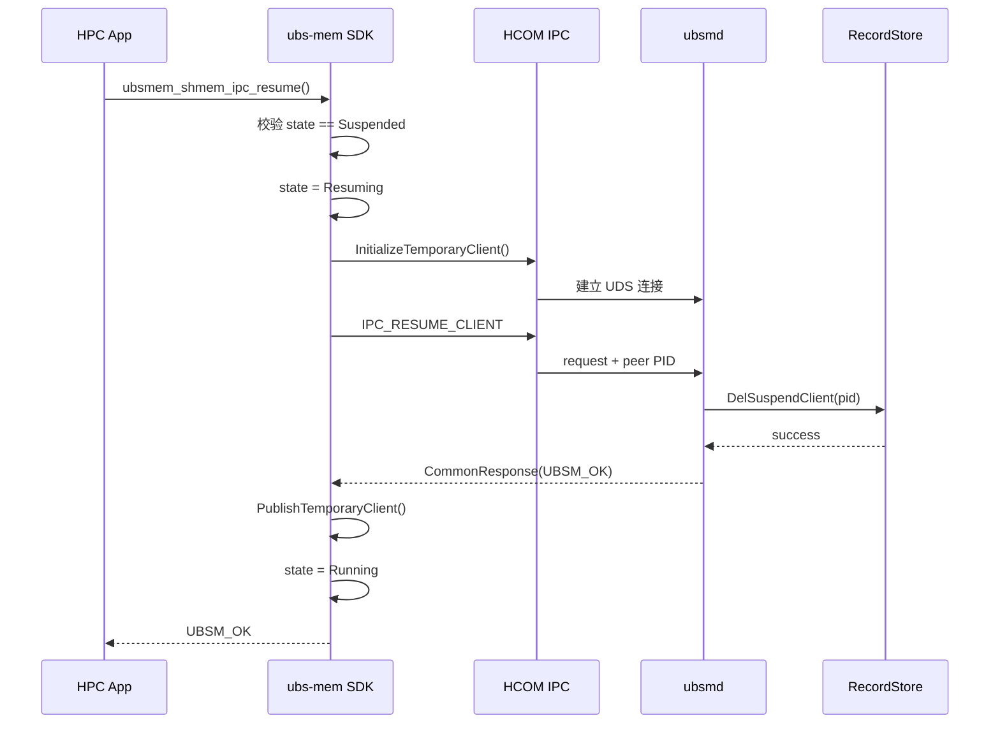
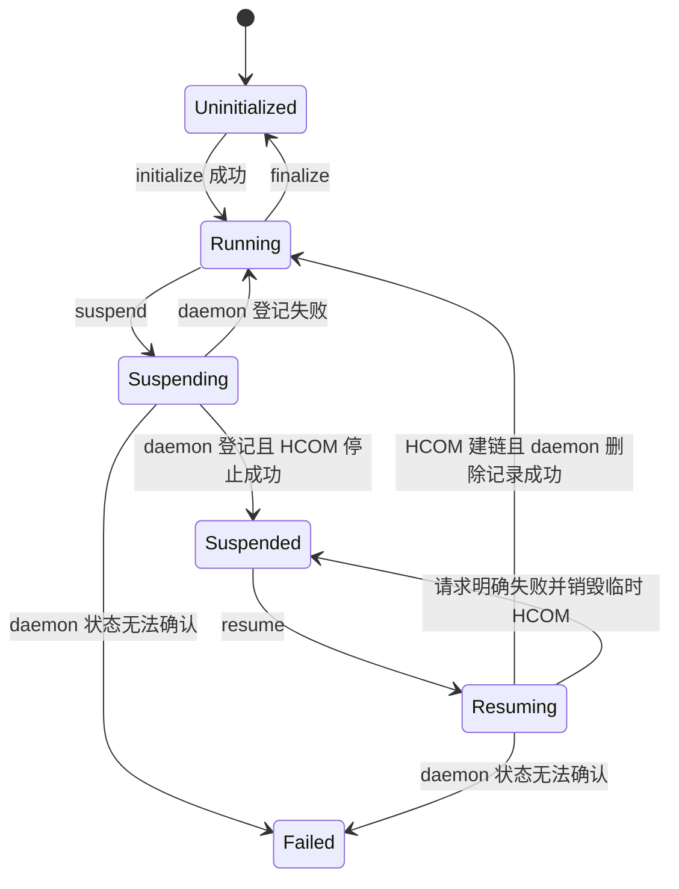

# ubs-mem IPC Suspend/Resume 功能设计

**作者：** openEuler sig-UB-ServiceCore

**创建日期：** 2026-07-28

**更新日期：** 2026-07-28

**相关 Issue：** [openeuler/ubs-mem#42](https://gitcode.com/openeuler/ubs-mem/issues/42)

## 1. 概述

### 1.1 简介

ubs-mem SDK 初始化后，会通过 HCOM 建立与 `ubsmd` 的 IPC 控制连接。当前
ubs-mem 代码明确配置了 6 个 HCOM worker；Issue #42 的运行环境共观察到 7 个
相关线程，第 7 个线程由目标版本 ubs-comm 创建，名称和退出语义需要结合该版本
进一步确认。这些线程负责共享内存创建、映射、查询和锁管理等控制操作，不参与
共享内存 map 后的普通数据访问，但会对 HPC 计算程序产生额外的 CPU 调度和运行
抖动。

本设计在 SDK 和 daemon 之间新增 `IPC_SUSPEND_CLIENT`、
`IPC_RESUME_CLIENT` 两个 IPC 控制消息，并提供以下公共接口：

```c
int ubsmem_shmem_ipc_suspend(void);
int ubsmem_shmem_ipc_resume(void);
```

应用完成内存分配和 map 后调用 suspend。daemon 记录客户端 PID，并在后续
HCOM 断链时跳过该客户端的资源清理；SDK 随后停止 HCOM client，使相关后台
线程退出。计算完成后调用 resume，SDK 重新初始化 HCOM、建立连接，并通知
daemon 删除 suspend 记录、恢复正常断链清理和控制功能。

### 1.2 动机

当前 SDK 控制通路如下：

```text
应用控制 API
    -> IpcProxy
    -> MxmIpcClient
    -> HCOM UDS
    -> ubsmd
```

共享内存 map 完成后的数据通路如下：

```text
应用 load/store
    -> 本进程 mmap 地址
    -> OBMM/UB 数据通路
```

map 成功后，普通内存读写不再经过 HCOM。因此停止 HCOM IPC client 不会主动
解除已有 VMA、关闭映射 fd 或改变 OBMM 数据通路。

但是，当前 daemon 将 HCOM `LINK_DOWN` 视为客户端进程退出，并通过
`UBSMemMonitor::RegisterHandler()` 触发共享内存和租赁资源清理。suspend 前
必须先通知 daemon，使 daemon 能够区分主动关闭 IPC 与异常退出。

### 1.3 目标

- suspend 成功后停止 SDK HCOM IPC client，使 6 个已配置 worker 及 Issue #42
  环境观察到的第 7 个相关线程退出。
- suspend 期间保留已经建立的共享内存映射和数据访问能力。
- suspend 期间依赖 IPC 的控制接口返回错误。
- resume 成功后重新初始化 HCOM、与 `ubsmd` 建链并恢复控制接口。
- daemon 在客户端主动 suspend 时不错误清理其共享内存和租赁资源。
- suspend/resume 支持重复调用且不破坏 IPC client 引用计数。
- suspend/resume 失败后 SDK 与 daemon 状态可回滚或可重试。
- daemon 能清理异常退出客户端遗留的 suspend PID 记录。
- 不改变已有共享内存数据面和 OBMM 映射格式。

非目标：

- 不暂停应用自身的计算线程。
- 不解除或重建已完成的共享内存映射。
- 不将 suspend 作为数据一致性、checkpoint 或进程迁移接口。
- 不提供初始化后 fork 的子进程恢复能力。
- 不停止 daemon 侧后台线程。

## 2. 现状分析

### 2.1 SDK 初始化与销毁

`ubsmem_initialize()` 通过 `RackMemLib::Initialize()` 初始化 `IpcProxy`，
调用链如下：

```text
ubsmem_initialize
    -> RackMemLib::Initialize
        -> IpcProxy::Initialize
            -> MxmComStartIpcClient
                -> MxmIpcClient::Start
                -> MxmIpcClient::Connect
```

HCOM client 使用 `NET_BUSY_POLLING` 模式，并配置 6 个 worker。Issue #42
环境观察到的第 7 个线程位于外部 ubs-comm 实现，不能仅通过本仓库代码确认。

`ubsmem_finalize()` 通过以下调用停止 IPC：

```text
ubsmem_finalize
    -> RackMemLib::Destroy
        -> IpcProxy::Destroy
            -> MxmComStopIpcClient
                -> MxmIpcClient::Stop
```

该流程同时销毁其他 SDK 模块，不适合直接作为计算阶段的 suspend 接口。

### 2.2 需要解决的问题

- SDK 没有显式 Running/Suspended 状态，重复 resume 会增加 IPC 引用计数。
- suspend/resume 与普通控制接口并发时，可能发生 client 指针竞争。
- `IpcProxy::Destroy()` 固定返回成功，不能确认 HCOM 是否真正停止。
- resume 消息失败后，新建 HCOM client 没有回滚。
- `IsClientSuspended()` 读取 suspend 数组时没有使用与增删操作相同的锁。
- suspended 客户端异常退出后不会再发送 resume，需要周期清理遗留 PID。
- suspend 数组需要校验 `count`，避免异常记录导致越界访问。

## 3. 用例和约束

### 3.1 正常使用流程

```text
initialize
-> allocate/create
-> map
-> suspend
-> 仅访问已映射内存
-> resume
-> unmap/deallocate
-> finalize
```

各状态下的行为如下：

| 状态 | 已映射数据访问 | IPC 控制接口 | HCOM 线程 |
| --- | --- | --- | --- |
| Running | 可用 | 可用 | 存在 |
| Suspending | 可用 | 不允许发起新调用 | 退出中 |
| Suspended | 可用 | 失败 | 不存在 |
| Resuming | 可用 | 不允许发起新调用 | 恢复中 |

### 3.2 使用约束

- suspend 前必须完成需要使用的 allocate、create 和 map 操作。
- suspend 期间仅允许访问已经获得的映射地址，并允许调用 resume。
- suspend 期间不得调用 allocate、deallocate、map、unmap、lookup、list、
  attach、detach、lock 和 unlock 等控制接口。
- suspend 前不得持有需要通过 IPC 释放的分布式锁。
- finalize 前应先调用 resume，恢复 daemon 的正常断链清理状态。
- suspend/resume 不支持与 fork 并用。

### 3.3 性能要求

- suspend 成功后，6 个已配置 worker 全部退出；Issue #42 环境观察到的第 7 个
  线程也应退出，并通过目标版本 ubs-comm 的集成测试确认。
- suspend 稳态不新增 SDK 后台线程。
- 已映射内存带宽和时延不因 suspend 发生显著回退。
- resume 成功后，HCOM worker 数量恢复到 suspend 前的数量。
- 连续执行 1000 次 suspend/resume 后，线程数、fd 数和 RSS 不持续增长。

## 4. 方案设计

### 4.1 总体方案

采用 IPC 通知方案：

1. SDK 通过已有 HCOM 连接发送 `IPC_SUSPEND_CLIENT`。
2. daemon 使用 HCOM 提供的 UDS peer PID，不信任客户端自报 PID。
3. daemon 将 PID 添加到 `RecordStore` 的 suspend client 数组。
4. daemon 返回成功后，SDK 停止 HCOM IPC client。
5. daemon 收到 `LINK_DOWN` 时查询 suspend client 数组并跳过资源清理。
6. resume 时 SDK 先重新创建 HCOM client 并建链。
7. SDK 发送 `IPC_RESUME_CLIENT`，daemon 删除 PID 记录。
8. daemon 返回成功后，SDK 恢复 Running 状态。

该方案不增加其他旁路连接。suspend/resume 控制消息复用现有 HCOM IPC 框架，
daemon 状态保存在 `RecordStore` 中。

### 4.2 Suspend 时序



顺序约束：daemon 必须先完成 PID 记录并返回响应，SDK 才能停止 HCOM。否则
`LINK_DOWN` 可能先于 PID 记录到达，导致 daemon 错误清理客户端资源。

### 4.3 Resume 时序



resume 必须先恢复 HCOM，才能发送 `IPC_RESUME_CLIENT`。在 daemon 尚未执行
删除操作时，新 HCOM 断链仍会被 suspend 记录保护。但如果 daemon 已删除记录而
响应丢失，SDK 不能再假设自己仍处于 Suspended，必须执行幂等重试；状态无法确认
时进入错误态，不能直接断开新 HCOM 后宣称回滚成功。

### 4.4 SDK 状态机



建议新增内部状态：

```cpp
enum class IpcSuspendState {
    UNINITIALIZED,
    RUNNING,
    SUSPENDING,
    SUSPENDED,
    RESUMING,
    FINALIZING,
    FAILED,
};
```

状态和 IPC client 生命周期由同一把 mutex 保护。接口幂等规则如下：

| 接口 | 当前状态 | 处理 |
| --- | --- | --- |
| suspend | Running | 执行 suspend |
| suspend | Suspended | 直接返回 `UBSM_OK` |
| resume | Suspended | 执行 resume |
| resume | Running | 直接返回 `UBSM_OK` |
| suspend/resume | Suspending/Resuming/Finalizing | 返回 `UBSM_ERR_BUSY` |
| suspend/resume | Uninitialized | 返回 `UBSM_ERR_MEMLIB` |
| 普通控制接口 | Failed | 返回错误，禁止继续修改资源 |

状态机用于避免重复 resume 调用 `MxmComStartIpcClient()` 并增加
`g_ipcClientCount`，保证一次 suspend 能实际销毁 HCOM client。

### 4.5 IPC 协议

新增 opcode：

```cpp
IPC_SUSPEND_CLIENT,
IPC_RESUME_CLIENT,
```

opcode 应继续追加在已有 IPC opcode 末尾，并建议固定显式数值，避免以后在枚举
中间插入成员导致协议编号变化。

请求使用现有 `MsgBase` 公共头，不携带 PID：

```text
msgVer
opCode
destRankId
```

PID 从 daemon 收到的 `MxmComUdsInfo.pid` 获取，避免客户端为其他进程伪造
suspend 状态。

响应复用 `CommonResponse`：

```cpp
struct CommonResponse {
    uint32_t errCode_;
};
```

daemon 必须区分以下错误：

| 场景 | 建议返回 |
| --- | --- |
| PID 已经 suspended | `UBSM_OK` |
| PID 不在 suspend 数组中且执行 resume | `UBSM_OK`，保持删除幂等 |
| suspend 数组已满 | `UBSM_ERR_BUSY` |
| RecordStore 未初始化或损坏 | `UBSM_ERR_RECORD` |
| opcode 不支持 | `UBSM_ERR_NOT_SUPPORTED` |
| 非法请求 | `UBSM_ERR_PARAM_INVALID` |

### 4.6 Daemon SuspendClientArray

daemon 使用以下数据结构记录 suspended client：

```cpp
constexpr uint32_t MAX_SUSPEND_CLIENT = 256;

struct SuspendClientArray {
    uint32_t count;
    uint32_t pids[MAX_SUSPEND_CLIENT];
};
```

该结构位于 `RecordStore` 共享记录区，由以下接口管理：

```cpp
int AddSuspendClient(pid_t pid) noexcept;
int DelSuspendClient(pid_t pid) noexcept;
bool IsClientSuspended(pid_t pid) const noexcept;
```

实现要求：

- Add、Del、Is 使用同一把 `cachedRecordMutex_`。
- 访问数组前校验 `count <= MAX_SUSPEND_CLIENT`。
- Add 已存在 PID 时返回成功。
- Del 不存在 PID 时返回成功，保证 resume 幂等。
- 删除使用末尾元素覆盖目标元素，保持 O(1) 删除。
- daemon 启动时校验数组并清理已经不存在的 PID。
- 周期性死进程清理完成后同步删除对应 suspend PID。
- `ClientProcessExited(pid)` 完成后删除对应 suspend PID，避免记录累积。

当前结构仅保存 PID，存在极端情况下 PID 重用的风险。是否扩展为 PID 加进程启动
时间，需要在实现前确认 `RecordStore` 布局兼容策略，见“未解决问题”。

### 4.7 LINK_DOWN 处理

在 `UBSMemMonitor::RegisterHandler(pid)` 入口增加 suspend 状态判断：

```cpp
if (RecordStore::GetInstance().IsClientSuspended(pid)) {
    return UBSM_OK;
}
return UBSMemMonitor::GetInstance().ManagerEventNotified(pid);
```

只跳过 HCOM `LINK_DOWN` 触发的即时清理。daemon 原有的周期性死进程检查仍应
运行，用于处理客户端在 Suspended 状态异常退出的场景。

周期性清理发现 PID 已死亡时，应同时执行：

```text
清理共享内存引用
-> 清理租赁内存记录
-> DelSuspendClient(pid)
```

### 4.8 Suspend 失败处理

| 失败点 | SDK 状态 | 处理 |
| --- | --- | --- |
| suspend 请求明确未发送 | Running | 不停止 HCOM，直接返回错误 |
| suspend 响应超时或丢失 | Suspending | 通过原 HCOM 幂等重试，不能直接判定 daemon 未登记 |
| daemon AddSuspendClient 失败 | Running | 不停止 HCOM，直接返回错误 |
| daemon 已登记但 HCOM Stop 失败 | Running 或错误态 | 尝试恢复 HCOM，并发送 RESUME 删除记录 |
| HCOM Stop 成功 | Suspended | 返回成功 |

`IpcProxy::Destroy()`、`MxmComStopIpcClient()` 和 HCOM Stop 需要返回实际结果。
suspend 不得在 HCOM 销毁失败时只记录日志后返回成功。

`AddSuspendClient(pid)` 必须幂等。SDK 只有收到明确成功响应后才停止 HCOM。
如果重试后仍无法确认 daemon 状态，SDK 保持 HCOM 连接并进入 `FAILED`，禁止
继续执行普通控制操作；不能简单恢复 Running，否则 daemon 可能遗留 suspend
记录并在后续真实断链时跳过清理。

### 4.9 Resume 失败处理

| 失败点 | 处理 |
| --- | --- |
| HCOM Initialize 失败 | 保持 suspend PID 记录，回到 Suspended |
| HCOM 建链失败 | 销毁临时 client，回到 Suspended |
| resume 请求明确未发送 | 销毁临时 client，回到 Suspended |
| resume 响应超时或丢失 | 保持新 HCOM，幂等重试，不能直接断链 |
| daemon 明确返回删除失败 | 销毁临时 client，保留 daemon PID 记录，允许重试 |

`DelSuspendClient(pid)` 必须幂等，PID 不存在时也返回成功。只有 daemon 返回
resume 成功后，SDK 才将状态切换为 Running。如果重试后仍无法区分“请求未执行”
和“请求已执行但响应丢失”，SDK 保持新 HCOM 并进入 `FAILED`，避免在 daemon
已经删除记录的情况下主动断链并触发资源清理。

现有 `IpcProxy::Initialize()` 会直接发布全局 client 并增加引用计数。为实现上述
回滚，需要重构出临时 client 初始化能力：HCOM 建链后先由 resume 流程独占
持有，收到 daemon 成功响应后再发布为全局 client；明确失败时销毁临时 client。

### 4.10 HCOM 线程退出保证

当前通信层断链后可能创建 detached reconnect 线程。为了满足“计算阶段没有资源
管理线程占核”的验收要求，需要同步完善 HCOM engine 生命周期：

- Stop 开始时设置 stopping 标志，禁止创建新的 reconnect 任务。
- reconnect 线程不能 detach，必须由 engine 持有并在 Stop 中 join。
- 先终止 reconnect，再销毁 channel 和 HCOM service。
- HCOM service Destroy 结果逐层返回给 suspend API。
- suspend 返回成功时，所有 HCOM worker 和 reconnect 线程均已退出。

### 4.11 并发设计

`g_mxmIpcClient`、`g_ipcClientCount` 和 SDK suspend state 必须由同一同步机制
保护，不能只依赖 atomic 引用计数。

suspend 执行前需要：

1. 阻止新的 IPC 控制请求进入。
2. 等待已经开始的 IPC 请求完成。
3. 发送 suspend 消息。
4. 销毁 IPC client。

普通控制 API 应在产生本地副作用前检查 SDK 是否为 Running。特别是 unmap 和
unlock 可能先修改本地映射或 ownership，再发送 IPC，不能仅依靠 IPC send 失败
阻止操作。

## 5. 接口设计

### 5.1 ubsmem_shmem_ipc_suspend

```c
SHMEM_API int ubsmem_shmem_ipc_suspend(void);
```

接口描述：

通知 daemon 当前客户端将主动停止 IPC，然后销毁 SDK HCOM IPC client。接口
成功后，已映射共享内存仍可访问，但依赖 IPC 的控制接口不可用。

输入参数：无。

返回值：

| 返回值 | 说明 |
| --- | --- |
| `UBSM_OK` | daemon 已记录 PID，HCOM client 及已确认线程已停止 |
| `UBSM_ERR_BUSY` | SDK 正在进行其他生命周期操作，或 daemon 记录已满 |
| `UBSM_ERR_NET` | suspend IPC 发送或 HCOM 通信失败 |
| `UBSM_ERR_RECORD` | daemon suspend 记录操作失败 |
| `UBSM_ERR_MEMLIB` | SDK 未初始化或 HCOM 停止失败 |
| `UBSM_ERR_NOT_SUPPORTED` | daemon 不支持该 opcode |

### 5.2 ubsmem_shmem_ipc_resume

```c
SHMEM_API int ubsmem_shmem_ipc_resume(void);
```

接口描述：

重新初始化 SDK HCOM IPC client，与 daemon 建链，并通知 daemon 删除当前 PID
的 suspend 记录。

输入参数：无。

返回值：

| 返回值 | 说明 |
| --- | --- |
| `UBSM_OK` | HCOM 已恢复，daemon suspend 记录已删除 |
| `UBSM_ERR_BUSY` | SDK 正在进行其他生命周期操作 |
| `UBSM_ERR_NET` | HCOM 初始化、建链或 resume IPC 失败 |
| `UBSM_ERR_RECORD` | daemon 删除 suspend 记录失败 |
| `UBSM_ERR_NOT_SUPPORTED` | daemon 不支持该 opcode |

### 5.3 调用示例

```c
ubsmem_options_t options;
ubsmem_init_attributes(&options);

int ret = ubsmem_initialize(&options);
if (ret != UBSM_OK) {
    return ret;
}

/* allocate/create/map */

ret = ubsmem_shmem_ipc_suspend();
if (ret != UBSM_OK) {
    ubsmem_finalize();
    return ret;
}

/* Only access previously mapped memory in this phase. */
run_hpc_computation();

ret = ubsmem_shmem_ipc_resume();
if (ret != UBSM_OK) {
    return ret;
}

/* unmap/deallocate */
return ubsmem_finalize();
```

## 6. 安全、兼容性与 DFX

### 6.1 安全

- daemon 只使用 HCOM UDS peer credential 中的 PID，不使用请求携带的 PID。
- suspend/resume 只允许客户端修改自身状态。
- suspend 数组操作必须检查边界并加锁。
- daemon 启动和周期任务必须清理无效记录，避免本地客户端耗尽固定数组。
- 日志记录 PID、操作类型和结果，不记录共享内存业务数据。

### 6.2 兼容性

- 新增公共 C 符号，不修改已有接口签名。
- 不修改 `ubsmem_options_t`。
- opcode 追加在已有 IPC opcode 末尾，不改变旧 opcode 编号。
- 老 SDK 不发送新 opcode，可继续连接新 daemon。
- 新 SDK 调用新接口连接旧 daemon 时返回 `UBSM_ERR_NOT_SUPPORTED` 或网络错误；
  应优先在消息分发层快速返回不支持，避免等待默认 60 秒超时。

### 6.3 可维护性

- suspend/resume 协议继续使用现有 `MsgBase`、`CommonResponse` 和 IPC handler
  注册框架。
- daemon suspend 状态集中由 `RecordStore` 管理。
- SDK 生命周期状态集中管理，不在多个公共 API 中维护独立布尔变量。
- 明确失败的错误路径必须恢复到 Running 或 Suspended；无法确认请求是否已在
  daemon 执行时进入 Failed，并保留避免错误清理所需的连接。

### 6.4 可观测性

日志至少记录：

```text
pid, operation, old_state, new_state, error_code, elapsed_us
```

需要记录：

- daemon 添加、删除和周期清理 suspend PID。
- LINK_DOWN 因 suspend 状态跳过清理。
- HCOM stop/start 成功或失败。
- resume 失败后的 client 回滚。
- suspend 数组损坏、已满和边界校验失败。

Suspended 稳态不得周期输出 SDK 日志或创建日志线程。

## 7. 测试与验收

### 7.1 SDK 单元测试

- initialize -> suspend -> resume -> finalize。
- 未初始化调用 suspend/resume。
- 重复 suspend。
- 重复 resume。
- resume without suspend。
- suspend/resume 与普通 IPC 调用并发。
- suspend/resume 与 finalize 并发。
- suspend 消息成功、HCOM Stop 失败时的回滚。
- HCOM 临时 client 初始化成功、resume 请求明确失败时的回滚。
- resume 响应丢失时保持新 HCOM 并进入 Failed，不能按普通失败断链回滚。
- IPC client 引用计数在重复调用后保持正确。

### 7.2 消息和 daemon 单元测试

- suspend/resume request 序列化和反序列化。
- opcode 到 request、response 和 handler 的注册。
- AddSuspendClient 重复添加。
- DelSuspendClient 重复删除。
- Add、Del、Is 并发执行。
- `count == MAX_SUSPEND_CLIENT` 边界。
- `count > MAX_SUSPEND_CLIENT` 损坏数据恢复。
- daemon 启动时清理死亡 PID。
- 周期性死进程清理同步删除 suspend PID。

建议测试位置：

```text
test/mxm-unit-tests/app_testcase/
test/mxm-unit-tests/mxm_message/
test/mxm-unit-tests/store/
test/mxm-unit-tests/monitor/
test/mxm-unit-tests/communication/ipc/
```

### 7.3 功能验收

1. 初始化 SDK，记录 `/proc/<pid>/task` 中的线程数量和名称。
2. 分配并 map 共享内存，写入已知数据。
3. 调用 suspend，确认返回 `UBSM_OK`。
4. 确认 6 个已配置 worker 退出，并在目标 ubs-comm 环境确认 Issue #42
   观察到的第 7 个线程退出。
5. 持续读写映射地址并校验数据正确。
6. 调用 lookup、map、unmap 等控制接口，确认按约定失败。
7. 调用 resume，确认返回 `UBSM_OK`。
8. 确认 HCOM 线程和 UDS 连接恢复。
9. 再次调用控制接口，确认功能恢复。
10. 重复 suspend/resume 1000 次，确认无线程、fd 和内存泄漏。

### 7.4 异常验收

- Suspended 状态下 `SIGKILL`，周期任务最终清理资源和 suspend PID。
- suspend 请求明确未执行时 daemon 退出，SDK 保持 Running。
- daemon 可能已登记但 suspend 响应丢失时，SDK 重试；无法确认时进入 Failed。
- resume 建链后 daemon 返回失败，SDK 回滚到 Suspended。
- daemon 重启后校验和清理旧 suspend 数组。
- 多客户端并行 suspend/resume。
- suspend 数组达到 256 项时返回明确错误且不越界。
- HCOM 断链重连与 suspend 同时发生时无线程残留和 UAF。

### 7.5 性能验收

- 使用 `/proc/<pid>/task` 验证 suspend 前后线程变化。
- 使用 `perf stat` 对比 suspend 前后的 `task-clock`、context switch 和 CPU
  migration。
- 对比 suspend 前后的 HPC kernel P50、P99 和最大时延。
- 对比 suspend 前后的共享内存带宽和访问时延。
- 记录 suspend/resume 操作自身的 P50 和 P99 延迟。

## 8. 风险

| 风险 | 影响 | 应对 |
| --- | --- | --- |
| Suspended 客户端崩溃后无法发送 resume | PID 记录和资源可能遗留 | 复用 daemon 周期死进程检查并同步删除记录 |
| PID 重用 | 新进程可能命中旧 suspend 记录 | 启动和周期清理；评估增加进程启动时间 |
| resume 部分成功 | SDK 与 daemon 状态不一致 | 幂等重试；临时 client 在 ACK 前不发布；状态不确定时保持连接并进入 Failed |
| 重复 resume 增加 IPC 引用计数 | 后续 suspend 无法真正停止线程 | 增加 SDK 状态机和幂等处理 |
| HCOM reconnect 使用 detached 线程 | suspend 后仍有线程或发生 UAF | 改为可 join 的受控线程 |
| suspend 与控制 API 并发 | client UAF 或本地状态部分修改 | 生命周期锁、在途请求计数和 API 入口状态检查 |
| 新 SDK 连接旧 daemon | 新 opcode 可能超时 | 未知 opcode 快速返回 NOT_SUPPORTED |

## 9. 未解决问题

1. “7 个后台线程”需要结合目标版本 ubs-comm 确认第 7 个线程的名称和 HCOM
   Destroy 同步退出语义。
2. `SuspendClientArray` 是否需要从 PID 扩展为 PID 加进程启动时间，以彻底规避
   PID 重用。
3. daemon 周期死进程扫描的最大清理延迟是否满足资源回收要求。
4. Suspended 状态调用 finalize 时，是要求用户先 resume，还是由 finalize 内部
   自动 resume 后再销毁。
5. suspend 前持有分布式读写锁时，是返回 `UBSM_ERR_BUSY`，还是允许只读计算
   阶段继续持锁。
6. 是否增加专用 `UBSM_ERR_INVALID_STATE`，还是复用 `UBSM_ERR_BUSY`。
7. 新 SDK 调用新接口连接旧 daemon 时，如何在现有消息框架中快速识别不支持，
   避免默认 IPC timeout。

## 10. 参考资料

- [Issue #42：ubs-mem 支持关闭额外的 7 个线程](https://gitcode.com/openeuler/ubs-mem/issues/42)
